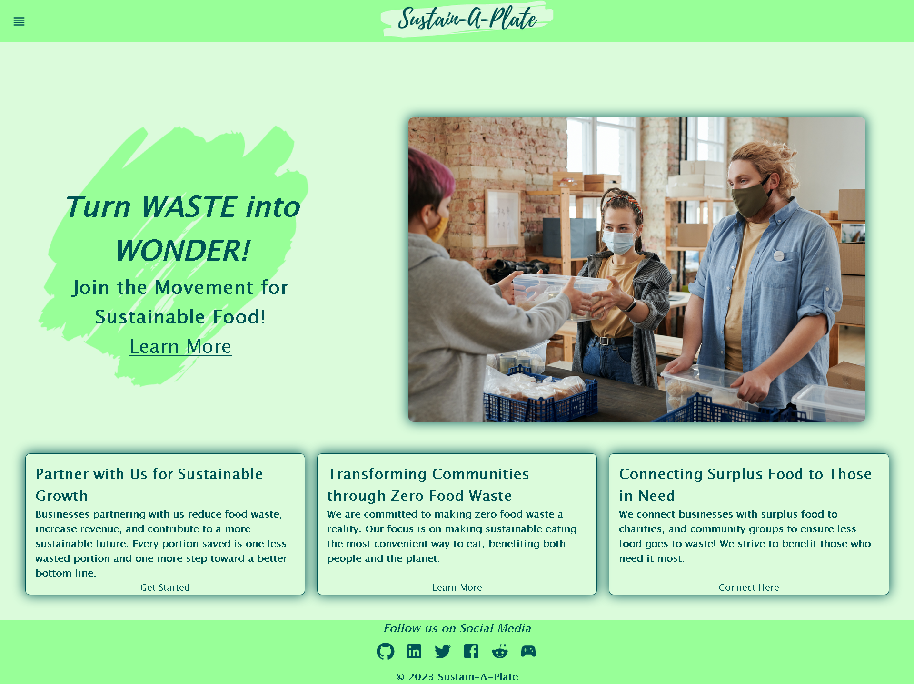

# Sustain-A-Plate

Sustain-A-Plate is a web application that allows users to explore sustainable and eco-friendly food options. The application provides information on restaurants, cafes, and food products that promote sustainability and environmental consciousness. Users can discover new eco-friendly food choices and contribute by adding their favorite sustainable food options to the platform.





## Table of Contents
- [Features](#features)
- [Installation](#installation)
- [Usage](#usage)
- [Technologies Used](#technologies-used)
- [Contributing](#contributing)
- [Questions](#questions)

## Features

- User Authentication: Users can sign up and log in to their accounts to access personalized content.
- Explore Sustainable Food Options: Users can browse a wide range of sustainable food choices, including restaurants, cafes, and food products.
- Add New Entries: Users can contribute to the platform by adding new sustainable food options they discover.
- Search and Filters: Users can easily search for specific food items or apply filters to find the exact sustainable options they are interested in.
- User Profiles: Each user has a profile page where they can view and manage their submissions and favorite sustainable food choices.

## Installation

Follow these steps to set up the project locally:

1. Clone the repository:

git clone https://github.com/Will-Riffe/Sustain-A-Plate.git


2. Navigate to the project root folder:

cd Sustain-A-Plate


3. Install dependencies for both the client and server:

```
cd client
npm install
cd ../server
npm install
```

4. Set up environment variables:

   - Create a `.env` file in the `server` folder and add the required environment variables.

5. Seed the database (if applicable):

```
cd server
npm run seed
```

- [Visit the website Here!](https://sustain-a-plate-a492ad2a8239.herokuapp.com/)

## Usage

- Select the Navigation icon on the header to visit the different pages of the website.
- Sign up and log in to start making food retrievals and to save your history of food recoveries accessable from your profile page.
- Select the "Food Recovery" option to see what stores are available to recover food from. 
- Select the "Recovery History" option to see what food recoveries you have previously made. 

To start the development server for both the client and server, run the following command from the project root:
```
npm run develop
```

The application will be accessible at `http://localhost:3000`.

## Technologies Used

- Front-end:
  - React
  - Apollo Client for GraphQL
  - Material-UI for styling
  - React Router for routing
  - jwt-decode for decoding JWT tokens

- Back-end:
  - Node.js
  - Express.js
  - MongoDB with Mongoose for data storage
  - Apollo Server for GraphQL
  - JSON Web Tokens (JWT) for user authentication

## Contributing

Contributions to Sustain-A-Plate are welcome! If you find any issues or have suggestions for improvements, please feel free to open an issue or submit a pull request.

To contribute to the project, follow these steps:

1. Fork the repository.
2. Create a new branch for your feature or bug fix.
3. Make changes and commit them.
4. Push the changes to your forked repository.
5. Submit a pull request to the main repository.

Before making substantial changes, please open an issue to discuss the proposed changes.

## Questions
 Contacts for questions about the software:

    Brandon Whitman:
        https://github.com/Bwhitman33
        Bwhitman33@gmail.com

    Will Riffe:
        https://github.com/Will-Riffe
        w_riffe@protonmail.com

    Muhammad Moghal:
        https://github.com/mmoghal
        mmoghal29@gmail.com

    Jason Geoghegan:
        https://github.com/ReallyAwesomeName
        jgeoghegan95@gmail.com

    Joseph Rodante:
        https://github.com/joeyrodo
        joeyrodo@gmail.com
