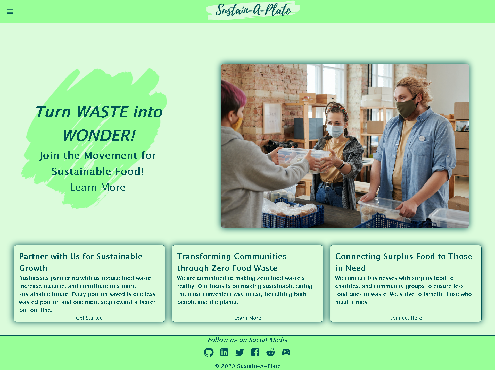

# Sustain - A - Plate

## Table of Contents
- [Description](#description)
- [Installation](#installation)
- [Usage](#usage)
- [Contributing](#contributing)
- [Questions](#questions)

## Description
- Sustain-A-Plate is a website that allows users see food businesses with excess food in order to retrieve the food and donate it to people and places in need.

## Installation
- [Visit the website Here!](https://sustain-a-plate-a492ad2a8239.herokuapp.com/)

## Usage
- Select the Navigation icon on the header to visit the different pages of the website.
- Sign up and log in to start making food retrievals and to save your history of food recoveries accessable from your profile page.
- Select the "Food Recovery" option to see what stores are available to recover food from. 
- Select the "Recovery History" option to see what food recoveries you have previously made.  

## Contributing
- This project will not feature any contributions.

## Questions
 Contacts for questions about the software:

    Brandon Whitman:
        https://github.com/Bwhitman33
        Bwhitman33@gmail.com

    Will Riffe:
        https://github.com/Will-Riffe
        w_riffe@protonmail.com

    Muhammad Moghal:
        https://github.com/mmoghal
        mmoghal29@gmail.com

    Jason Geoghegan:
        https://github.com/ReallyAwesomeName
        jgeoghegan95@gmail.com

    Rohin Manak:
        https://github.com/RohinM14
        rohinmanak1114@gmail.com

    Joseph Rodante:
        https://github.com/joeyrodo
        joeyrodo@gmail.com
